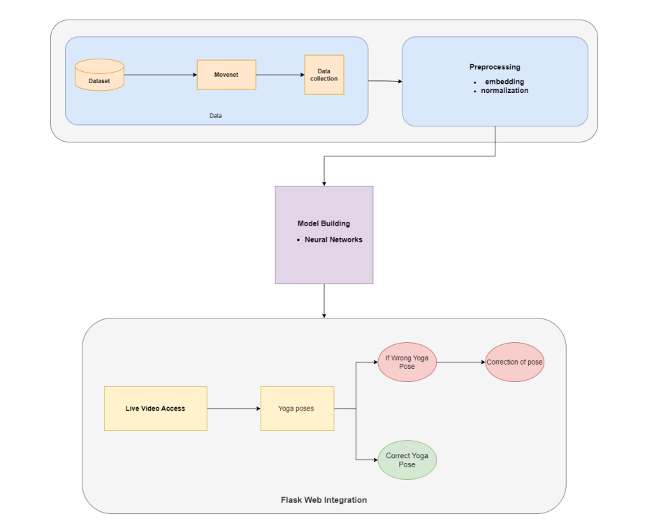

# Yoga Pose Estimation and Feedback System

A web-based application that assists users in performing yoga poses with real-time video processing and feedback using a webcam. This project leverages pose estimation models to analyze user posture and provide corrective guidance through both visual and auditory feedback.

## Table of Contents

- [Introduction](#introduction)
- [System Architecture](#system-architecture)
- [Features](#features)
- [Installation](#installation)
- [Project Structure](#project-structure)
- [Usage](#usage)
- [Technologies Used](#technologies-used)
- [Contributing](#contributing)
- [License](#license)

## Introduction

This project aims to help users practice yoga by providing real-time feedback on their poses. Using a webcam, the application captures the user's movements and utilizes TensorFlow-based pose estimation to analyze the accuracy of the poses. The system provides both visual cues on the video feed and auditory instructions to guide users in adjusting their posture.

## System Architecture



## Features

- Real-time video processing using webcam.
- Pose estimation and analysis with TensorFlow Movenet model.
- Visual feedback with skeletal overlay and pose accuracy indicators.
- Auditory feedback using pyttsx3 to provide real-time instructions.
- User-friendly web interface with Flask.

## Installation

### Prerequisites

- Python 3.7 or later
- Flask
- OpenCV
- TensorFlow
- Keras
- pyttsx3

### Steps

1. Clone the repository:

    ```bash
    git clone https://github.com/your-username/your-repo-name.git
    cd your-repo-name
    ```

2. Install the required packages:

    ```bash
    pip install -r requirements.txt
    ```

3. Download the pose estimation model and place it in the appropriate directory:

    ```bash
    # Example command to download the model
    wget https://path-to-your-model/movenet_thunder.tflite -P models/
    ```


## Project Structure

```plaintext
📂 yoga-pose-estimation/
├── 📂 examples/
│   └── 📂 utils/
├── 📂 poses_images_out_test/
│   └── (Output images of human poses from the test set)
├── 📂 poses_images_out_train/
│   └── (Output images of human poses from the training set)
├── 📂 static/
│   └── (Contains images for the Flask website)
├── 📂 templates/
│   └── (Contains HTML and CSS files for the web interface)
├── 📂 yoga_poses/
│   └── (Dataset of yoga poses used for training and testing)
├── 📄 train_data.csv ( It contains train extracted data from movenet )
├── 📄 test_data.csv ( It contains test extracted data from movenet )
├── 📄 bend.mp3
├── 📄 chair.jpg
├── 📄 chair.mp3
├── 📄 correct.mp3
├── 📄 dogpose.jpg
├── 📄 downdog.jpg
├── 📄 goddess.jpg
├── 📄 handle.mp3
├── 📄 handsup.mp3
├── 📄 landmarksnames.png
├── 📄 model.h5
├── 📄 model.json
├── 📄 model.tflite
├── 📄 movenet_thunder.tflite
├── 📄 newmodel.h5
├── 📄 raiseleg.mp3
├── 📄 test_data.csv
├── 📄 train_data.csv
├── 📄 teststream.py
├── 📄 app.py
└── 📄 requirements.txt
```


## Usage

1. Run the Flask application:

    ```bash
    python app.py
    ```

2. Open your web browser and navigate to `http://127.0.0.1:5000/`.

3. Follow the on-screen instructions to select and perform a yoga pose. The system will provide real-time feedback to help you adjust your posture.

## Output Video

Here is a demonstration of the application in action:

https://github.com/Noorullah162/AiYogaTrainer/assets/113673268/a95e526f-add3-4113-9065-cbc7673493a9


## Technologies Used

- **Flask**: Web framework for building the application.
- **OpenCV**: Library for real-time computer vision.
- **TensorFlow & Keras**: Machine learning framework for pose estimation.
- **pyttsx3**: Text-to-speech conversion library.
- **HTML/CSS/JavaScript**: Front-end technologies for building the user interface.

## Contributing

Contributions are welcome! Please open an issue or submit a pull request with any improvements or new features.

1. Fork the repository
2. Create your feature branch (`git checkout -b feature/YourFeature`)
3. Commit your changes (`git commit -m 'Add some feature'`)
4. Push to the branch (`git push origin feature/YourFeature`)
5. Open a pull request


